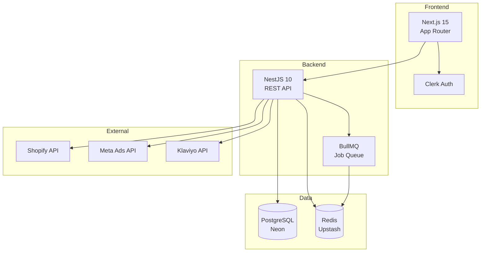

# PriceWatch - Competitive Intelligence for E-commerce

> Monitor competitors, detect changes, and automate counter-attacks for your Shopify store.

## 🚀 Quick Start (5 minutes)

### Prerequisites

- Node.js 20+
- pnpm 9+
- Docker (for local development)

### 1. Clone and Install

```bash
git clone https://github.com/your-org/pricewatch.git
cd pricewatch
pnpm install
```

### 2. Setup Environment

```bash
cp .env.example .env.local
```

Edit `.env.local` with your credentials:
- **Clerk**: Get keys at [clerk.com](https://clerk.com)
- **Neon**: Get database at [neon.tech](https://neon.tech)
- **Upstash**: Get Redis at [upstash.com](https://upstash.com)

### 3. Start Development

```bash
# Start PostgreSQL and Redis
docker-compose up -d postgres redis

# Run database migrations
pnpm db:push

# Start all apps
pnpm dev
```

- **Frontend**: http://localhost:3000
- **API**: http://localhost:4000
- **API Docs**: http://localhost:4000/docs

## 📁 Project Structure

```
├── apps/
│   ├── web/                 # Next.js 15 frontend
│   │   ├── src/
│   │   │   ├── app/         # App Router pages
│   │   │   ├── components/  # React components
│   │   │   └── lib/         # Utilities
│   │   └── ...
│   └── api/                 # NestJS 10 backend
│       ├── src/
│       │   ├── core/        # Auth, DB, Queue modules
│       │   ├── modules/     # Feature modules
│       │   └── common/      # Shared DTOs, guards
│       └── ...
├── packages/
│   ├── db/                  # Drizzle ORM schema
│   ├── types/               # Shared TypeScript types
│   ├── ui/                  # shadcn/ui components
│   └── utils/               # Shared utilities
└── ...
```

## 🏗️ Architecture



## 🛠️ Tech Stack

### Frontend
- **Next.js 15** - React framework with App Router
- **TailwindCSS** - Utility-first CSS
- **shadcn/ui** - UI components
- **Clerk** - Authentication
- **React Query** - Server state management
- **Zustand** - Client state management

### Backend
- **NestJS 10** - Node.js framework
- **Drizzle ORM** - Type-safe database access
- **PostgreSQL** - Primary database (Neon)
- **Redis** - Caching & queues (Upstash)
- **BullMQ** - Background job processing
- **Swagger** - API documentation

### DevOps
- **Turborepo** - Monorepo build system
- **Docker** - Containerization
- **GitHub Actions** - CI/CD
- **Vercel** - Frontend hosting
- **Railway** - Backend hosting

## 📜 Available Scripts

```bash
# Development
pnpm dev              # Start all apps
pnpm dev:web          # Start frontend only
pnpm dev:api          # Start backend only

# Build
pnpm build            # Build all packages
pnpm build:web        # Build frontend
pnpm build:api        # Build backend

# Database
pnpm db:generate      # Generate migrations
pnpm db:push          # Push schema to database
pnpm db:studio        # Open Drizzle Studio

# Testing
pnpm test             # Run all tests
pnpm test:cov         # Run tests with coverage

# Linting
pnpm lint             # Lint all packages
pnpm format           # Format with Prettier
```

## 🔐 Environment Variables

See [.env.example](.env.example) for all required variables.

### Required for Development
- `DATABASE_URL` - PostgreSQL connection string
- `REDIS_URL` - Redis connection string
- `CLERK_SECRET_KEY` - Clerk API key
- `NEXT_PUBLIC_CLERK_PUBLISHABLE_KEY` - Clerk public key

## 📊 API Modules

| Module | Description |
|--------|-------------|
| **Users** | User management, settings |
| **Competitors** | Competitor tracking |
| **Scans** | Competitor scanning jobs |
| **Counter-Attacks** | Automated responses |
| **Integrations** | OAuth connections |
| **Webhooks** | Incoming/outgoing webhooks |

## 🚢 Deployment

### Frontend (Vercel)
1. Connect GitHub repo to Vercel
2. Set environment variables
3. Deploy automatically on push

### Backend (Railway)
1. Create Railway project
2. Add PostgreSQL and Redis services
3. Deploy from GitHub

## 📈 Scaling Considerations

- **Database**: Neon auto-scales, consider read replicas at 10k+ users
- **Redis**: Upstash serverless scales automatically
- **API**: Horizontal scaling with Railway/Fly.io
- **Queues**: BullMQ workers can be scaled independently

## 🤝 Contributing

1. Fork the repository
2. Create feature branch (`git checkout -b feature/amazing`)
3. Commit changes (`git commit -m 'Add amazing feature'`)
4. Push to branch (`git push origin feature/amazing`)
5. Open Pull Request

## 📄 License

MIT © PriceWatch
